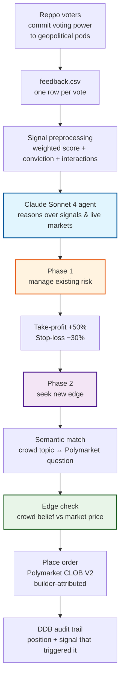

# Geopolitical Prediction Market Trading Agent

*An autonomous AI agent that turns curated crowd intelligence from [Reppo](https://reppo.ai) into positions on [Polymarket](https://polymarket.com).*

---

## The thesis

Prediction markets are advertised as the wisdom of crowds, but that wisdom only ever surfaces at one place: the price. By the time a Polymarket question on Iran, Taiwan, or the next Fed decision has digested an event, the edge has already been arbitraged out. The traders who profit are the ones who saw it coming a layer earlier.

This agent looks for that earlier layer.

Reppo runs a curated geopolitical intelligence community where voters spend a finite "voting power" budget across topics ("pods") they care about — Hormuz traffic, ceasefire durability, sanctions regime stability, election dynamics. Voting power is scarce, so every up-vote and down-vote is a *costly signal*: voters cannot back everything, which means what they choose to back tells you something they actually believe. When that belief diverges meaningfully from what Polymarket is pricing the same outcome at, we have an edge — and the agent acts on it.

That's the whole story:

> **Curated communities with conviction publish belief earlier than markets price it. We buy the gap.**

Everything below is the machinery that takes that thesis from a CSV of votes to a limit order on the Polymarket CLOB.

---

## How a vote becomes a trade



---

## 1. Where the data comes from

Reppo's curated voters look at the world and decide what matters. They allocate voting power — an exhaustible resource — toward the events they think are mispriced, mistold, or about to inflect. Each interaction with a pod produces one row in `feedback.csv`:

```
┌─────────────────┬───────┬──────────────┬─────────┬─────────────────────┬────────┐
│ name            │ votes │ voting_power │ up_vote │ feedback            │ status │
├─────────────────┼───────┼──────────────┼─────────┼─────────────────────┼────────┤
│ Hormuz Updates  │ 1.0   │ 1.0          │ true    │ Critical chokepoint │ ACTIVE │
│ Iran Ceasefire  │ 0.8   │ 1.0          │ false   │ Unlikely to hold    │ ACTIVE │
│ Oil Price Spike │ 0.5   │ 1.0          │ true    │                     │ ACTIVE │
└─────────────────┴───────┴──────────────┴─────────┴─────────────────────┴────────┘
```

Three things make this richer than a sentiment poll:

- **`votes` is staked, not free.** A voter committing 0.8 of 1.0 of their voting power to "this ceasefire will not hold" is putting most of their conviction on the line. They cannot also commit 0.8 to a competing claim — opportunity cost is real.
- **`voting_power` is per-voter, not global.** It lets us compute conviction relative to what a voter could have spent, not just absolute vote counts. One whale and ten coin-flippers don't drown each other out.
- **`feedback` carries qualitative texture.** The free-text comment (`"Ceasefire terms unsustainable given current tensions"`) is what an analyst would write. We surface it to the LLM verbatim so it can prefer signals with reasoned justification over reflex up-votes.

The CSV is uploaded to S3 between runs; each agent invocation reads the latest snapshot and reasons over the freshest community state.

---

## 2. Turning belief into a signal

Raw rows are noisy. A pod with three votes from one person is not the same thing as a pod with thirty votes from twenty people, and a pod where everyone gave it 0.05 isn't the same as one where someone bet half their power on it. So we collapse votes into three numbers per topic:

```python
weighted_score = (up_votes − down_votes) / (up_votes + down_votes)   # −1.0 … +1.0
max_conviction = max(individual_vote / voter_total_power)            #  0.0 … 1.0
interactions   = count(unique_votes)                                 #  reliability
```

`weighted_score` is *which way* the crowd leans. `max_conviction` is *how hard* its strongest believer is leaning. `interactions` is *how many people* showed up at all — a cheap reliability filter against signals that are really just one loud voter.

A topic that earns a place at the agent's attention looks like this:

```
Topic: "Iran Ceasefire Collapse"
  crowd_direction = NO
  weighted_score  = −0.85
  max_conviction  =  1.00
  interactions    = 12
  comment: "Ceasefire terms unsustainable given current tensions"
```

Twelve voters, an aggregate score saying "no, this won't hold", at least one voter putting their entire budget on it, and a written rationale. That's an intelligence note, not a chat poll.

---

## 3. Where the agent comes in

Signals don't trade themselves. The Reppo crowd thinks in terms of the world ("Iran-Israel ceasefire"); Polymarket thinks in terms of contracts ("Will the Iran-Israel ceasefire hold through June 2026?"). Bridging the two is a reasoning problem, which is why the agent is built around Claude Sonnet 4 with native tool use rather than hard-coded keyword matching.

Each run, Claude is handed:

1. The processed signal table (above) as plain text.
2. A live snapshot of the top ~300 active Polymarket markets by 24h volume.
3. A short list of tools — `get_positions`, `close_position`, `check_balance`, `get_open_markets`, `place_order`.

It then runs a strict two-phase loop. The order matters: protect existing capital before deploying new capital.

### Phase 1 — Manage existing risk

Before chasing new opportunities, the agent looks at what's already on the books. For every position in DynamoDB:

- Fetch the live best-bid from Polymarket — that's what we'd actually receive selling right now.
- Compute realised P&L against the entry price.
- Close any position that's hit **+50% take-profit** (let winners run, but not forever) or **−30% stop-loss** (cut losers before they teach a more expensive lesson).
- Skip positions where the order book is unreachable (`is_stale=true`) — we don't make exit decisions on data we can't see — and skip positions that haven't filled yet (`position_status="pending"`).

The reasoning Claude produces on every hold/close decision is logged. Over time, that log becomes the audit trail for *why* we held and *why* we cut.

### Phase 2 — Find a new edge

Only after Phase 1 is clean does the agent go hunting:

1. Confirm the wallet has at least the **$15 reserve** in pUSD. If not, abort — no new orders this run.
2. Pull the active market list. Match each crowd topic to a market question by semantic reasoning, not by string overlap. ("Iran Ceasefire Collapse" matches "Will the Iran-Israel ceasefire hold through June 2026?" — and Claude is the right tool for that match.)
3. For every match that survives the quality filter, check whether the crowd's belief is *already priced in*. If it is, no edge. If it isn't, we have a candidate trade.
4. Place at most one order per run, capped at **$10** of pUSD.

The single-order-per-run rule is intentional. It forces the agent to pick its highest-conviction bet rather than spray capital across mediocre matches.

---

## 4. The edge in one diagram

```
Crowd signal:    "Iran Ceasefire Collapse"   direction = NO   score = −0.85
                                  ↓ semantic match
Polymarket:      "Will Iran-Israel ceasefire hold through June 2026?"
                                  ↓ price check
Live prices:     YES = 0.72   NO = 0.28
                                  ↓ divergence
Edge:            Crowd says ceasefire fails (NO) with high conviction,
                 but the market is only pricing NO at 0.28.
Action:          BUY NO shares at ~0.28 — if the crowd is right, NO drifts up.
```

For a trade to actually fire, the signal *and* the price gap both have to clear quality bars:

| Filter | Threshold | Why |
|---|---|---|
| `\|weighted_score\|` | > 0.70 | The crowd has to be clearly leaning, not split. |
| `max_conviction` | > 0.30 | At least one voter has staked real budget on this. |
| `interactions` | ≥ 3 | Three independent humans, minimum. |
| Crowd YES + market YES price | < 0.50 | Market disagrees enough for the trade to be worth it. |
| Crowd NO + market YES price | > 0.50 | Same, on the other side. |

Anything that doesn't clear all five gets logged with a reason and skipped. Most signals do not lead to trades — that's the system working as designed.

---

## 5. Risk: protect the thesis from any one bet

A long-running experiment dies from concentrated losses long before it dies from being wrong on average. The agent's risk framework exists so that no single mis-call ends the test:

| Control | Threshold | Implementation |
|---|---|---|
| Take-profit | +50% return | Auto-close when hit |
| Stop-loss | −30% loss | Auto-close when hit (priced 0.02 below best bid for guaranteed exit) |
| Max order size | $10 pUSD | Hard cap in code, ignores LLM input above this |
| Wallet reserve | $15 pUSD | Phase 2 aborts if below |
| Limit-price sanity | ±5% of last price | Rejects fat-finger limits |
| One position per market | enforced in DDB | Prevents accidental hedging against ourselves |
| One new entry per run | enforced in prompt | Forces highest-conviction selection |
| Tick & min-order size | per-market | Skip the market rather than place an invalid order |

The agent also runs every order through Polymarket's CLOB V2 with a builder code attached, so attribution is recorded on-chain and we can verify execution against the [Builder Leaderboard](https://builders.polymarket.com/) independently of our own logs.

---

## 6. What we learn either way

This is a live experiment, not a guaranteed alpha source. There are exactly three outcomes, and all three are useful:

1. **The agent makes money.** Curated geopolitical communities lead market prices, the divergence-buying thesis works, and we have a generalisable pattern: crowd signal → signal processing → semantic match → CLOB order.
2. **The agent loses money cleanly.** The community's beliefs are sincere but uncorrelated with outcomes — interesting, because it tells us *expert-feeling* commentary is not the same as *predictive* commentary, and we know to filter differently next time.
3. **The agent breaks even or oscillates.** Some signal types work, others don't. The audit trail (signal that triggered every trade, P&L it produced) is exactly the dataset needed to figure out which.

Either way, the loss ceiling per bet is 30% of $10. We can run a long time before we run out of test budget.

---

## Operational shape

| | |
|---|---|
| **Schedule** | Every 4 hours (AWS EventBridge) |
| **Runtime** | ~60–90 seconds per execution |
| **Trading venue** | Polymarket CLOB V2 (Polygon, pUSD collateral) |
| **Wallet** | POLY_PROXY signature type, EOA key signs on behalf of proxy funder |
| **Builder attribution** | Single bytes32 builder code attached to every order |
| **AI** | Claude Sonnet 4 with tool use (5 tools, ~4–8 calls per run) |
| **Storage** | DynamoDB single-table for positions; S3 for `feedback.csv` and dashboard snapshot |
| **Runtime** | AWS Lambda |
| **Infra-as-code** | AWS CDK |

### Paper-trading mode

Set `DRY_RUN=true` on the Lambda. All reasoning, market matching, signal processing, and tool routing run normally; the actual `create_and_post_order` call is replaced with a structured log line. Use this for at least a week before pointing real capital at it.

---

## Getting started

### Prerequisites

- An AWS account with CDK bootstrapped.
- A Polymarket-funded proxy wallet with pUSD collateral and an exported EOA private key.
- A builder code from your [Polymarket builder profile](https://polymarket.com/settings?tab=builder).
- An Anthropic API key.

### Deploy

```bash
pip install -r requirements.txt

cd infra && cdk deploy

python scripts/upload_csv.py --file data-assets/feedback.csv

# Set on the Lambda directly (or move to Secrets Manager before scaling capital):
#   ANTHROPIC_API_KEY, POLYGON_PRIVATE_KEY, POLYMARKET_WALLET_ADDRESS, BUILDER_CODE
```

### Test

```bash
python -m pytest tests/test_signals.py
python -m pytest tests/test_tools_mock.py

DRY_RUN=true python -m agent.handler
```

---

## What an actual run looks like

```
2026-04-15T14:30:00Z  Signal table built. Starting agent loop (DRY_RUN=false)
2026-04-15T14:30:02Z  Phase 1: 3 open positions
2026-04-15T14:30:04Z   BTC-election:    +45% P&L → hold (under +50% TP)
2026-04-15T14:30:06Z   Iran-sanctions:  −25% P&L → hold (above −30% SL)
2026-04-15T14:30:08Z   Oil-spike:       +52% P&L → CLOSE (take-profit)
2026-04-15T14:30:12Z  Phase 2: pUSD balance $47.50 (ok_to_trade=true)
2026-04-15T14:30:15Z  Fetched 287 active markets, matched 3 signals
2026-04-15T14:30:18Z  "Taiwan Strait Tension" ↔ "Will China invade Taiwan by 2027?"
2026-04-15T14:30:20Z   crowd YES (+0.78), market YES = 0.35 → EDGE
2026-04-15T14:30:25Z  Placed BUY YES @ 0.38 ($8.00, 21.05 shares)
                       order_id=0x9a3c…  status=matched  builder=0xa6f1…
2026-04-15T14:30:26Z  Done. 1 close, 1 entry, 6 tool calls, 56s.
```

That last block is the whole pipeline made concrete: a community of voters thought Taiwan-Strait tension was being underpriced, the agent agreed the question was tradeable, and an order was matched on chain. Whether they're right is a separate story — but now we have a position to find out with.

---

## Closing thought

Markets are good at aggregating known belief into price. They are slower at incorporating belief that hasn't been spoken yet. A curated community with skin in the game is one of the few places that belief surfaces *before* it becomes consensus. This agent is a small, disciplined attempt to read that surface and act on it — sized so a wrong read is a footnote, and a right read compounds.

The dataset is small. The community is one. The hypothesis is unproven.

That's exactly what makes it worth running.

---

*Built at the intersection of AI agents, prediction markets, and curated geopolitical intelligence. Deploy responsibly with appropriate risk limits.*
