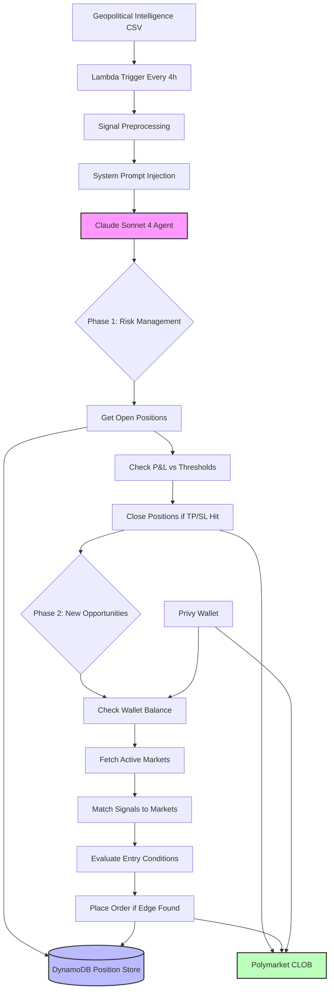

# Geopolitical Prediction Market Trading Agent

An autonomous AI agent that analyzes crowdsourced geopolitical intelligence signals and executes trading strategies on Polymarket prediction markets based on sentiment divergence.

## Overview

This agent transforms community intelligence into trading alpha by identifying when crowd sentiment meaningfully diverges from market prices on geopolitical outcomes.

### Core Concept

**Signal → Analysis → Trade**
- **Signal**: Crowdsourced voting data on geopolitical topics with conviction weighting
- **Analysis**: AI agent matches signals to live prediction markets, identifies price divergence  
- **Trade**: Autonomous execution of limit orders when edge conditions are met

## System Architecture



## Data Flow: Intelligence to Trades

### 1. Geopolitical Signal Collection
```
CSV Input: feedback.csv
┌─────────────────┬───────┬──────────────┬─────────┬─────────────────────┬────────┐
│ name            │ votes │ voting_power │ up_vote │ feedback            │ status │
├─────────────────┼───────┼──────────────┼─────────┼─────────────────────┼────────┤
│ Hormuz Updates  │ 1.0   │ 1.0          │ true    │ Critical chokepoint │ ACTIVE │
│ Iran Ceasefire  │ 0.8   │ 1.0          │ false   │ Unlikely to hold    │ ACTIVE │
│ Oil Price Spike │ 0.5   │ 1.0          │ true    │                     │ ACTIVE │
└─────────────────┴───────┴──────────────┴─────────┴─────────────────────┴────────┘
```

### 2. Signal Aggregation & Scoring
```python
# For each topic, compute:
weighted_score = (up_votes - down_votes) / (up_votes + down_votes)  # -1.0 to +1.0
max_conviction = max(individual_vote / voter_total_power)           # 0.0 to 1.0
interactions = count(unique_votes)                                  # Signal reliability
crowd_direction = "YES" if weighted_score >= 0 else "NO"
```

**Example Output:**
```
Topic: "Iran Ceasefire Collapse"
  crowd_direction=NO  weighted_score=-0.85  max_conviction=1.00  interactions=12
  comment: "Ceasefire terms unsustainable given current tensions"
```

### 3. Market Matching & Edge Detection

The AI agent uses semantic reasoning to match crowd topics to live Polymarket questions:

```
Crowd Signal: "Iran Ceasefire Collapse" (direction=NO, score=-0.85)
       ↓ (semantic matching)
Market: "Will Iran-Israel ceasefire hold through June 2026?"
       ↓ (price divergence analysis)
Current Price: YES = 0.72, NO = 0.28
       ↓ (edge calculation)
Edge Found: Crowd says NO (-0.85), but market prices NO at only 0.28
Action: BUY NO shares (crowd believes ceasefire more likely to fail)
```

### 4. Entry Conditions (All Must Be Met)

**Signal Quality Filters:**
- `|weighted_score| > 0.70` — Strong directional conviction
- `max_conviction > 0.30` — At least one voter staked >30% of total voting power  
- `interactions ≥ 3` — Minimum community engagement threshold

**Price Divergence Triggers:**
- Crowd says YES and market YES price < 0.40, OR
- Crowd says NO and market YES price > 0.60

**Risk Controls:**
- Maximum $10 per order (configurable)
- No opposing positions in same market
- Minimum $15 wallet balance reserve

## Agent Decision Process

### Phase 1: Risk Management (Always First)
```
1. Query all open positions from DynamoDB
2. Fetch live market prices from Polymarket CLOB  
3. Calculate P&L for each position
4. Auto-close any positions hitting take-profit (+50%) or stop-loss (-30%)
5. Log reasoning for each hold/close decision
```

### Phase 2: Opportunity Discovery
```
1. Check wallet USDC balance → Abort if below reserve
2. Fetch top 100 active Polymarket markets by volume
3. Match market questions to crowd signal topics using LLM reasoning
4. Evaluate each match against entry conditions
5. Place maximum 1 order per run if edge found
6. Record position in DynamoDB with audit trail
```

## Risk Management Framework

### Position-Level Controls
| Control | Threshold | Implementation |
|---------|-----------|----------------|
| Take Profit | +50% return | Auto-close when hit |
| Stop Loss | -30% loss | Auto-close when hit |
| Max Order Size | $10 USD | Hard-coded cap |
| Balance Reserve | $15 USD | No new orders below |
| Price Sanity | ±5% of market | Reject extreme limit prices |

### Portfolio-Level Controls
- **One position per market** — Prevents hedging against own positions
- **One new order per run** — Limits exposure accumulation
- **Risk-first sequencing** — Always manage existing positions before seeking new ones

### Wallet Security (Privy Integration)
- **TEE key storage** — Private keys never leave secure enclave
- **Policy enforcement** — Spend caps and protocol whitelist enforced pre-signature
- **Polygon-native** — Direct USDC operations, no bridging required

## Operational Model

### Scheduling
- **Frequency**: Every 4 hours via AWS EventBridge
- **Runtime**: ~60-90 seconds per execution
- **Timeout**: 5 minutes maximum

### Monitoring & Observability
- **CloudWatch Logs**: Full execution trace, tool calls, reasoning
- **Position Dashboard**: Real-time P&L and trade history via S3 snapshot
- **Error Alerting**: Lambda failures trigger operator notification

### Paper Trading Mode
```bash
# Test agent logic without capital risk
export DRY_RUN=true
```
All trading logic executes normally but orders are logged instead of submitted.

## Key Technologies

- **AI Agent**: Claude Sonnet 4 with native tool-use capabilities
- **Trading Venue**: Polymarket CLOB (Polygon L2)
- **Wallet**: Privy server wallet with policy controls
- **Data Store**: DynamoDB single-table design
- **Runtime**: AWS Lambda with EventBridge scheduling
- **Infrastructure**: AWS CDK for deployment

## Getting Started

### Prerequisites
- AWS account with CDK configured
- Privy developer account
- Polymarket API access
- Anthropic API key

### Deployment
```bash
# Install dependencies
pip install -r requirements.txt

# Deploy infrastructure
cd infra && cdk deploy

# Upload initial signal data
python scripts/upload_csv.py --file data/feedback.csv

# Configure environment variables (see technical-spec.md §8.3)
```

### Testing
```bash
# Run signal preprocessing tests
python -m pytest tests/test_signals.py

# Run tool integration tests  
python -m pytest tests/test_tools_mock.py

# Paper trading (1 week minimum recommended)
export DRY_RUN=true && python -m agent.handler
```

## Signal Quality & Limitations

### Current Dataset
- **Time Period**: 3 weeks of community voting data
- **Community Size**: 26 active voters across 51 geopolitical topics  
- **Signal Reliability**: Unvalidated — no ground-truth outcome data yet

### Known Limitations
- **Sample Size**: Too small for statistical validation of predictive power
- **Binary Voting**: Limited discriminating power vs. probabilistic scoring
- **Single Community**: May not represent broader market wisdom
- **No Backtesting**: Live trading P&L is the validation dataset

### Success Metrics
- **Signal Validation**: Track prediction accuracy over 4+ weeks of live operation
- **Risk Management**: Verify take-profit/stop-loss execution under market stress
- **Execution Quality**: Monitor fill rates and slippage vs. limit prices

## Example Execution Log

```
2026-04-15T14:30:00Z | Signal table built. Starting agent loop (DRY_RUN=false)
2026-04-15T14:30:02Z | Phase 1: Found 3 open positions
2026-04-15T14:30:04Z | Position BTC-election: +45% P&L, holding (below +50% TP threshold)
2026-04-15T14:30:06Z | Position Iran-sanctions: -25% P&L, holding (above -30% SL threshold)  
2026-04-15T14:30:08Z | Position Oil-spike: +52% P&L, CLOSING (take-profit triggered)
2026-04-15T14:30:12Z | Phase 2: Wallet balance $47.50 USDC (ok_to_trade=true)
2026-04-15T14:30:15Z | Fetched 100 active markets, matched 3 signals to questions
2026-04-15T14:30:18Z | Signal "Taiwan Strait Tension" matched to "Will China invade Taiwan by 2027?"
2026-04-15T14:30:20Z | crowd_direction=YES (+0.78), market YES price=0.35 → EDGE DETECTED
2026-04-15T14:30:25Z | Placed BUY YES @ $0.38 ($8.00 order) | signal="Taiwan Strait Tension"
2026-04-15T14:30:26Z | Agent completed. 1 close, 1 new entry, 6 tool calls, 56 seconds
```

## Philosophy: Crowd Intelligence as Trading Alpha

Traditional prediction markets aggregate individual beliefs through price discovery. This agent leverages **pre-market sentiment** from engaged geopolitical observers to identify mispricings before they self-correct.

The hypothesis: **Dedicated intelligence communities with skin-in-the-game (voting power commitment) generate actionable signals that lead broader market sentiment.**

Success validates this approach. Failure teaches us about the limits of crowdsourced geopolitical prediction.

---

*Built for the intersection of AI agents, prediction markets, and geopolitical intelligence. Deploy responsibly with appropriate risk limits.*